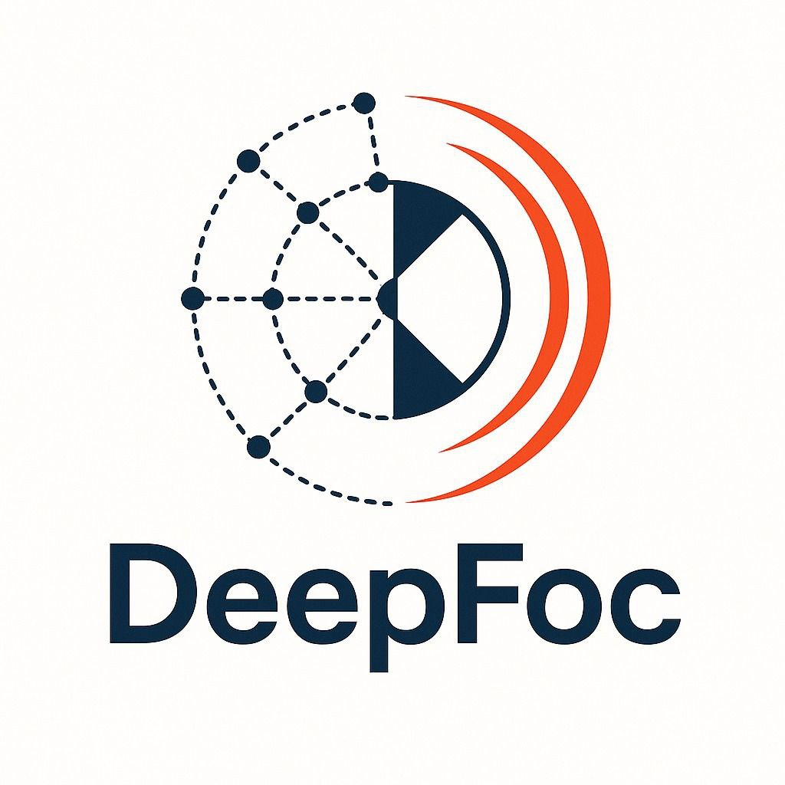

# DeepFoc: Deep learning framework for determining earthquake focal mechanisms with application to the Campi Flegrei caldera



This repository contains code for seismic analysis and focal mechanism inversion using deep learning. It includes scripts for training and testing a custom model that predicts focal mechanism parameters, comparing model outputs with results obtained via FPfit. Additionally, there are tools for synthetic data generation, performance evaluation, and visualization (e.g., Amplitude comparison plots, beachball plots).

## Table of Contents
- [Overview](#overview)
- [Repository Structure](#repository-structure)
- [Requirements](#requirements)
- [Installation](#installation)
- [Usage](#usage)
  - [Analysis](#analysis)
  - [Training](#training)
  - [Testing and Evaluation](#testing-and-evaluation)
- [Acknowledgements](#acknowledgements)

## Overview

The project implements a complete pipeline for seismic data analysis, including:

- **Data Generation**: Generation of synthetic data using seismic station information and a velocity model.
- **Data Preprocessing**: Simulation of missing or unpicked stations and addition of noise to the recordings.
- **Model Training**: Distributed training (using PyTorch) of a custom model (e.g., AmplitudePolaritiesModel) with GPU support.
- **Evaluation and Testing**: Test scripts that perform predictions on both real and synthetic datasets, compute metrics (e.g., Kagan Loss), and compare the model’s predictions with the results obtained from FPfit.
- **Visualization**: Creation of comparative plots (CP comparisons, beachball plots) to interpret focal mechanisms.
- **Integration with FPfit**: Direct comparison between FPfit inversion solutions and the model’s predictions.

## Repository Structure

| File/Directory                          | Description                                                                    |
| :-------------------------------------- | :------------------------------------------------------------------------------|
| `./`                                    |                                                                                |
| ├── `code/`                             | Main folder for scripts and modules                                            |
| │   ├── `MODELS/`                       | Output directory for trained models.                                           |
| │   ├── `utils/`                        | Custom modules: loss functions, synthetic data generation, various utilities.  |
| │   ├── `fpfit/`                        | Integration with FPfit for focal mechanism inversion.                          |
| │   ├── `fpyfit/`                       | Python version of FPFIT multithreaded.                                         |
| │   ├── `analysis.py`                   | Scripts for data generation analysis.                                          |
| │   ├── `build_fortran_modules.py`      | Scripts for fortran module for the generation.                                 |
| │   ├── `test.py`                       | Main script for testing and model evaluation.                                  |
| │   └── `train.py`                      | Script for training (supports distributed training).                           |
| ├── `data/`                             | Main folder for data.                                                          |
| │   ├── `INPUT/`                        | Input data: velocity model files, seismic station data, etc.                   |
| │   └── `REAL_TEST_CAMPI_FLEGREI/`      | Real test dataset for the Phlegraean Fields area.                              |
| └──`results/`                           | Output directory for generated results.                                        |


## Requirements
- Ubuntu 20.04+
- Python 3.11, Fortran
- [PyTorch](https://pytorch.org/) (compatible version for your hardware)
- Numpy, Pandas, Matplotlib, Seaborn, pytorch-lightning
- PyYAML, fastcore, tqdm
- (Other dependencies specified in `aibeachball.yml`)

## Installation

### 1. **Clone the repository:**

```bash
git clone https://github.com/MODAL-UNINA/DEEPFOC.git
cd DEEPFOC
```

### 2. Installing packages

```bash
sudo apt update && sudo apt install build-essential gfortran ghostscript libx11-dev xorg-dev xserver-xorg-dev
```

### 3. **Set up the environment:**

You have two options to set up the environment:

- **Using the Conda environment file**:  
    Create a Conda environment directly from the provided aibeachball.yml file by running:  
    ```conda env create -f aibeachball.yml```

- **Manual installation**:  
    Alternatively, follow the detailed installation instructions provided in the `conda_installation.txt` file.

## Usage

### Preliminary operations

In order to execute the codes, the necessary compiled files must be created. Since the files are hardware-dependent, run the bash file `run_preliminary.sh`, or execute the commands within the file

```bash
bash run_preliminary.sh
```

### Analysis

To run the analyses, execute:
```bash
python -u analysis.py
```

The `analysis.py` file contains a series of analyses on:

- **Generation Grid**: Analysis of the distribution of strike, dip, rake, and x, y, z coordinates.
- **Beta Distribution**: Analysis of the Beta distribution as mode and total variation change.
- **Velocity Model**: The velocity model for the Campi Flegrei area used for data generation.
- **Generated Data**: Analysis of the variation in P-wave radiation patterns generated by changes in the Kagan angle, focal mechanism (strike, dip, rake), earthquake hypocenter, and grid boundary limits.
- **Preprocessing**: Analysis of data variation due to preprocessing (zeroing and adding noise to amplitudes).

### Training

To train the model, run:
```bash
python -u train.py
```

The training script (`train.py`) initiates distributed training for the custom model (e.g., AmplitudePolaritiesModel) using PyTorch. It performs the following tasks:

- Loads station and velocity model data from the `INPUT` directory.
- Sets up the distributed training environment across available GPUs.
- Saves model checkpoints and training configurations in the `MODELS` directory.
- Logs training progress and evaluation metrics.

Make sure that the required input files (e.g., `stations_campi_flegrei.dat` and `velmod_campi_flegrei.dat`) are placed in the `INPUT` folder, and that the test dataset (e.g., `test_real.csv`) is located in the `REAL_TEST_CAMPI_FLEGREI` folder.

### Testing and Evaluation

To evaluate the trained model, run:

```bash
python -u test.py
```

The testing script (`test.py`) performs the following steps:

- Loads the best saved model parameters from the `results` directory.
- Processes both real and synthetic test datasets from the `REAL_TEST_CAMPI_FLEGREI` folder.
- Computes focal mechanism predictions and evaluation metrics (such as Kagan Loss).
- Generates comparative plots (e.g., CP comparison plots and beachball plots) to visually compare the model’s performance with FPfit inversion results.

This script provides detailed insights into the model's performance and robustness on the test datasets.

## Acknowledgements
The work was produced with the co-financing of the European Union - Next Generation EU. This publication has been supported by the project titled D.I.R.E.C.T.I.O.N.S. - Deep learning aIded foReshock deteCTIOn Of iNduced mainShocks, project code: P20220KB4F, CUP: E53D23021910001, PRIN 2022 - Piano Nazionale di Ripresa e Resilienza (PNRR), Mission 4 “Istruzione e Ricerca” - Componente C2 Investimento 1.1, “Fondo per il Programma Nazionale di Ricerca e Progetti di Rilevante Interesse Nazionale (PRIN)”. This work was partially supported by the PNRR project FAIR -  Future AI Research (PE00000013), Spoke 3, under the NRRP MUR program funded by the NextGenerationEU.